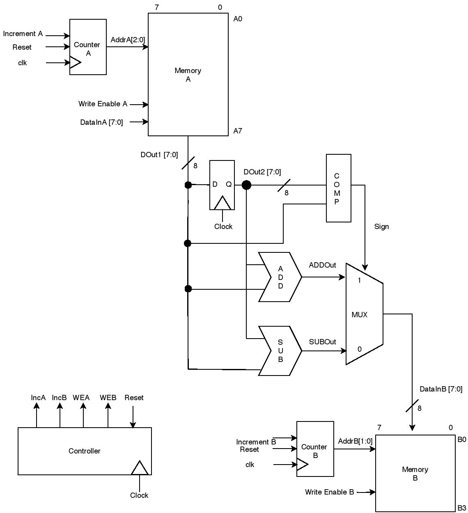
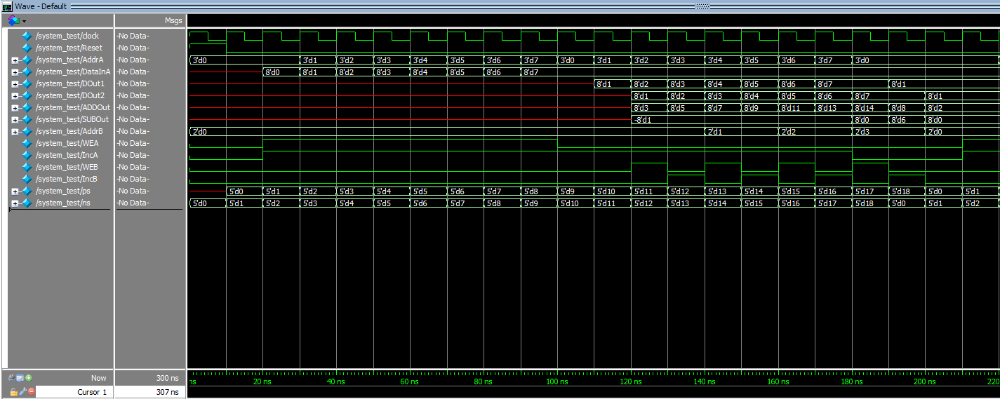
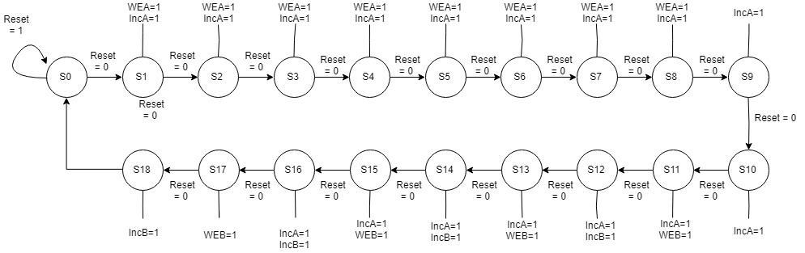

# memory-to-memory-transfer

A simple memory-to-memory transfer designed in Verilog. 

## Theory

The design implements a memory-to-memory transfer of 8-bit data packets between a 8x8 source memory (Memory A) to a 8x4 target memory (Memory B). This starts by the the writing of eight 8-bit data packets into Memory A. Afterwards, the data is read one data packet at a time from Memory A and passed through to the processing step. This processing step compares two consecutive data packets (exclusively; no data packet can be compared twice) and either subtracts them from each other or adds them and writes the result into Memory B. Essentially, the compared data packets will be A0/A1, A2/A3, A4/A5, and A6/A7. 

### Memory A

Memory A is a 8x8 memory block which can store eight 8-bit data packets. Data is written to the memory through DataInA[7:0] and read through DOut1[7:0]. 

### Memory 

Memory B is a 8x4 memory block which can store four 8-bit data packets. Data is written to the memory through DataInB[7:0], the output of the 2-to-1 MUX. 

### Counter A

Counter A is a simple 3-bit up-counter which increments on the positive edge of the clock cycle. The value of the counter is used as an address index into Memory A. The purpose of this logic circuit is to specify the address of Memory A for when data is written to the memory (through the DataInA wire) and read from the memory (through the DOut1 wire).

### Counter B

Counter B is a simple 2-bit up-counter which increments on the positive edge of the clock cycle. The value of the counter is used as an address index into Memory B. 

### D Flip-Flop
 
A D Flip-Flop was implemted to pass data through during the positive edge of the clock cycle. As a result, DOut2[7:0] will be the previous data packet read from Memory A and DOut1[7:0] will be the current data packet read from Memory A. The purpose of the D Flip-Flop is to have these consecutive data packets to be compared and processed before being written into Memory B. 

### Comparator, Adder, Subtractor, Mux

The two consecutive data packets read from Memory A have to be pre-processed before being written into Memory B. They are first passed through a comparator which compared both and outputs a 1-bit Sign value (1 if DOut2<DOut1 or 0 if DOut2>DOut1). This Sign value is used as a selector to a 2-to-1 MUX which passed through the result of ADDOut or SUBOut. Essentially, if DOut2 is greater than DOut1, the comparator outputs a 0 for the Sign but and the result of SUBOut is passed through ahd written to Memory B. Otherwise, if DOut2 is less than DOut1, the comparator outputs a 1 for the Sign but and the result of ANDOut is passed through the MUX and written to Memory B. 

### Controller

The controller is what outputs the control signals that govern the states of the dataflow. A Moore-machine is used to model the transitions of the states. 

## Methodology

The design was broken up into separate modules and individually verified through Verilog test fixtures. Once verified, the modules were combined together and the entire system was verified as a whole. 

## Results

The timing diagram of the final system is shown below.

The Moore-type state machine is shown below.

## References

Bindal, A. (2019). Fundamentals of Computer Architecture and Design. 2nd ed. Cham: Springer International Publishing AG.

